# FEMA NFIP Data Analysis Capstone Project
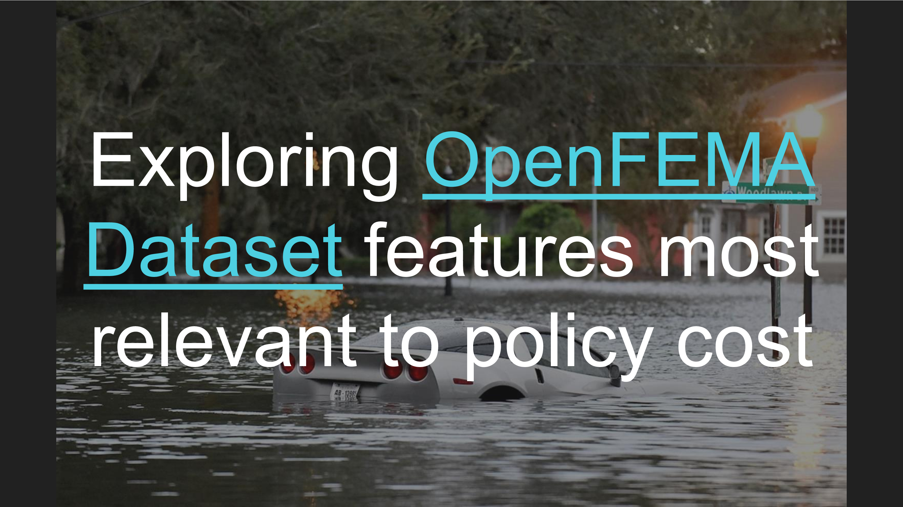

## Table of Contents
1. [Introduction](#introduction)
2. [Data Wrangling](#data-wrangling)
3. [Exploratory Data Analysis (EDA)](#exploratory-data-analysis-eda)
4. [Preprocessing](#preprocessing)
5. [Modeling](#modeling)
6. [Results & Findings](#results--findings)
7. [Conclusion](#conclusion)
8. [Possible Future Steps](#possible-future-steps)

---

## Introduction

### Project Overview
This capstone project analyzes data from the National Flood Insurance Program (NFIP), administered by the Federal Emergency Management Agency (FEMA). Climate change increases extreme weather and flood risks, and insurance companies are abandoning properties as risks increase. And as climate change worsens, flood risks are only projected to increase. [“Because flooding is the primary vector of economic damages inflicted on local communities as demonstrated by the 2016-2019 hurricane seasons, and given the projected increase in destructive flooding as a result of climate change, there's an enormous need to more efficiently distribute financial risk due to climate change.”](https://www.kaggle.com/datasets/lynma01/femas-national-flood-insurance-policy-database)

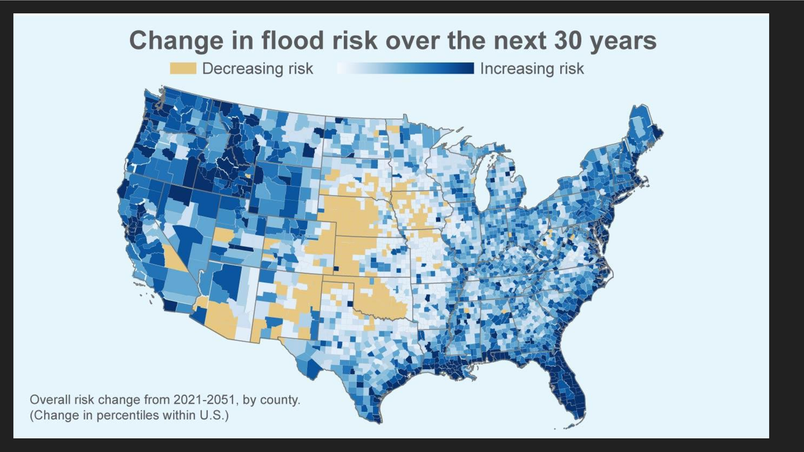

### Data Source
As of March 2026, the [OpenFEMA dataset](https://www.fema.gov/openfema-data-page/fima-nfip-redacted-policies-v2) comprises 70+ million rows of comprehensive NFIP policy information, making this a large scale data analysis challenge.

### Objectives
- **Primary Goal**: Explore the features most relevant to `policyCost`
- **Secondary Goals**: Observe other features or trends that could be useful for future analysis
- **Key Stakeholders**: Insurance professionals, FEMA analysts, risk assessment teams

### Dataset Overview
- **Total Records in Full Dataset**: 72583994 rows as of March 2026
- **Sampled Training Data**: 356837
- **Sampled Test Data**: 356675
- **Target Variable**: `policyCost`
- **Features**: See details in the [OpenFEMA dataset](https://www.fema.gov/openfema-data-page/fima-nfip-redacted-policies-v2)

---

## Data Wrangling

### Overview
Data wrangling prepares the raw NFIP data for analysis by addressing inconsistencies, handling missing values, and organizing information into a usable format.

### Process Workflow
**File**: `sample.ipynb`

1. **Data Extraction**: Downloaded and accessed the `FimaNfipPoliciesV2.parquet` file from FEMA's OpenFEM platform
2. **Sampling Strategy**: 
   - Sampled representative subsets from the 70+ million row dataset via hash-based deterministic sampling
   - Train: hash(idx+42) % 200 = 0 (~0.5%)
   - Test: hash(idx+42) % 200 = 1 (~0.5%)
   - No sort - streams through data; reproducible as long as original parquet is unchanged

**File**: `datawrangling.ipynb`

3. **Data Cleaning**:
   - Identified and handled missing values
   - Removed duplicate records
   - Over 80 columns, many of which were missing many values
   - Only kept latitude, longitude, and all columns with fewer missing values than those
   - Other outliers I removed include dates before the earliest valid `datetime[ns]`

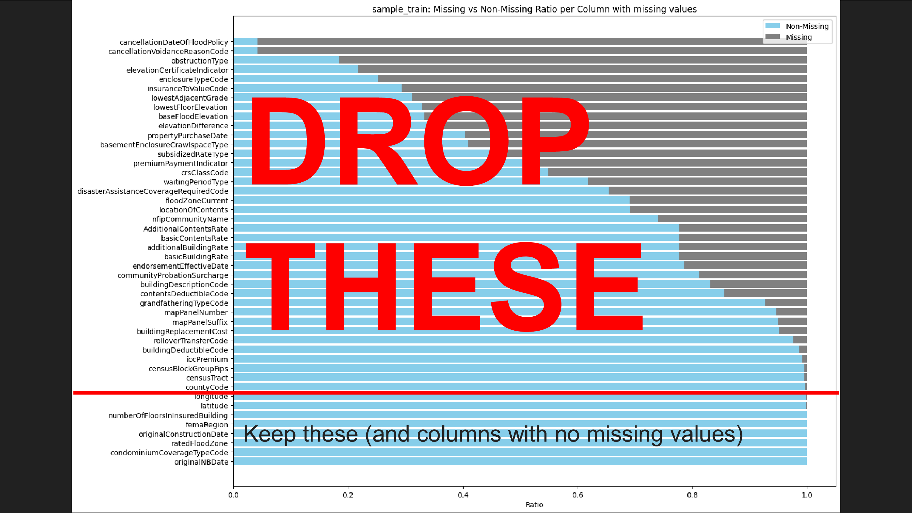

### Output
- Cleaned training dataset: `datawrangling_train.parquet`
- Cleaned test dataset: `datawrangling_test.parquet`

---

## Exploratory Data Analysis (EDA)

### Overview
EDA investigates the structure, distribution, and relationships within the NFIP data to uncover patterns and insights.

**File**: `eda.ipynb`

### Key Analyses Performed

#### **Bivariate & Multivariate Analysis**
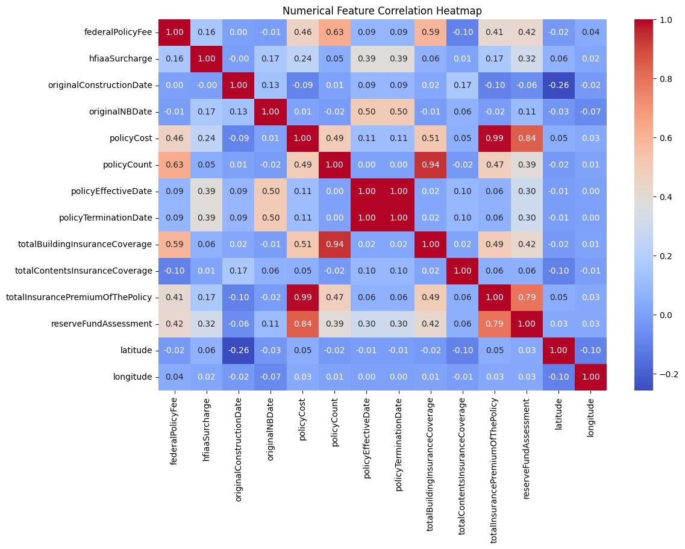
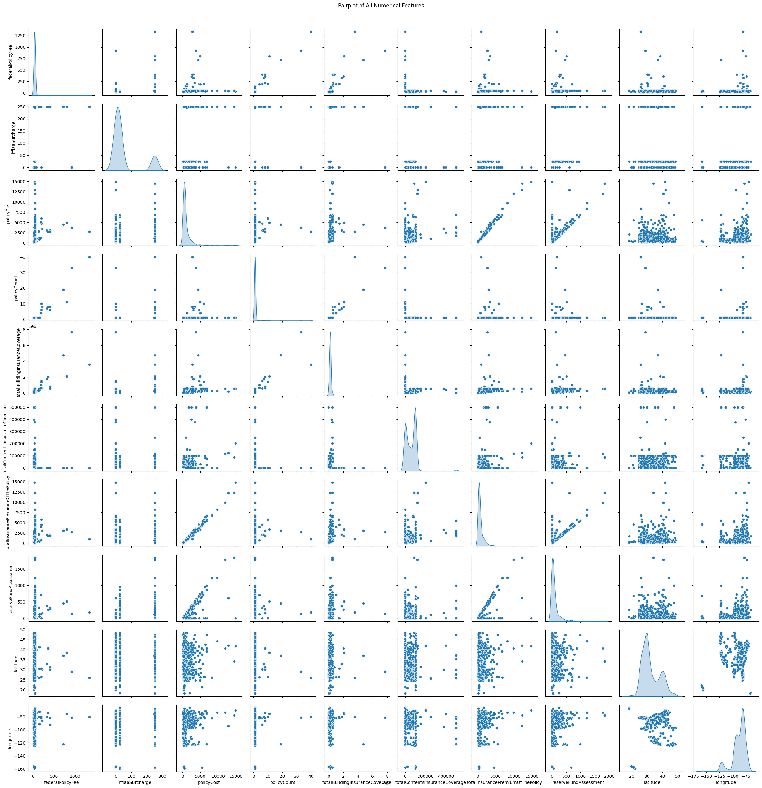
- Correlations with policyCost:
   - policyCost                          1.000000
   - totalInsurancePremiumOfThePolicy    0.993556
   - reserveFundAssessment               0.842859
   - totalBuildingInsuranceCoverage      0.508772
   - policyCount                         0.490588
   - federalPolicyFee                    0.464107
   - hfiaaSurcharge                      0.239486
   - policyTerminationDate               0.112648
   - policyEffectiveDate                 0.112647
   - totalContentsInsuranceCoverage      0.053317
   - latitude                            0.049968
   - longitude                           0.033054
   - originalNBDate                      0.006363
   - originalConstructionDate           -0.094056
- Financial variables most correlated with policyCost

#### **Geographic Analysis**
- Regional patterns in policy distribution
- Risk concentration by state/district
- Handled outliers in the UK and Colombia

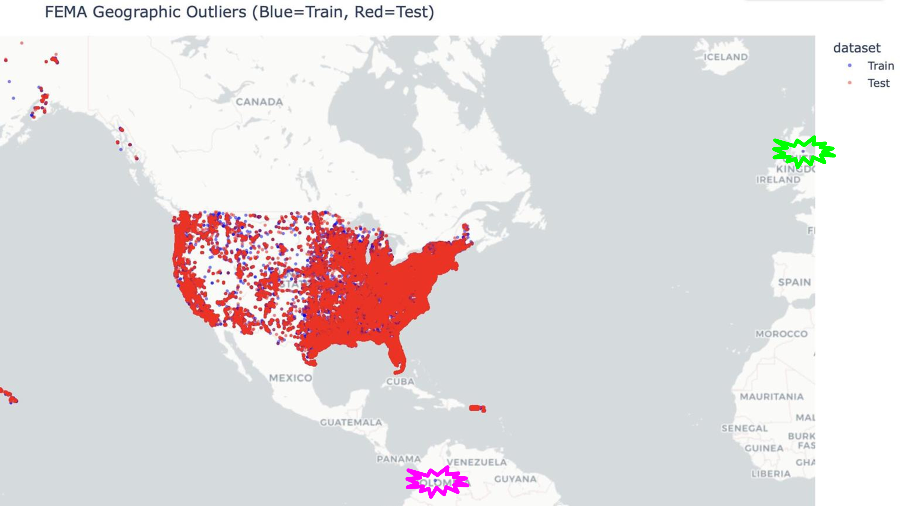
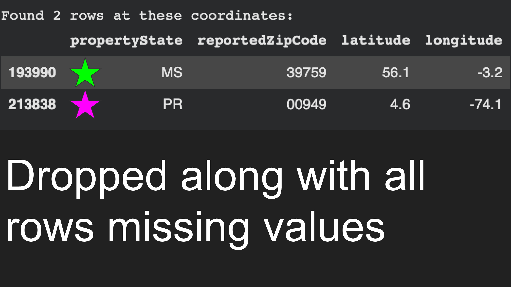

---

## Preprocessing

### Overview
Preprocessing transforms the analyzed data into machine-learning-ready features while preserving data integrity and preventing information leakage.

**File**: `preprocessing.ipynb`

### Steps Performed

#### 1. **Feature Engineering**
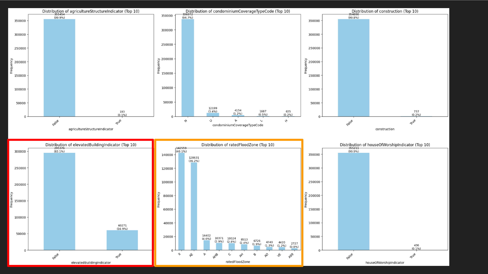
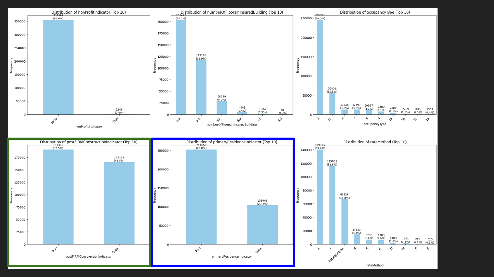
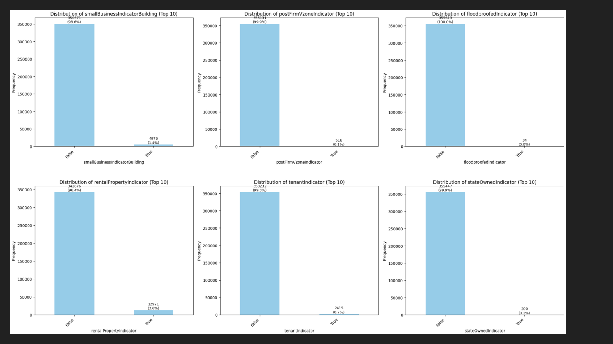
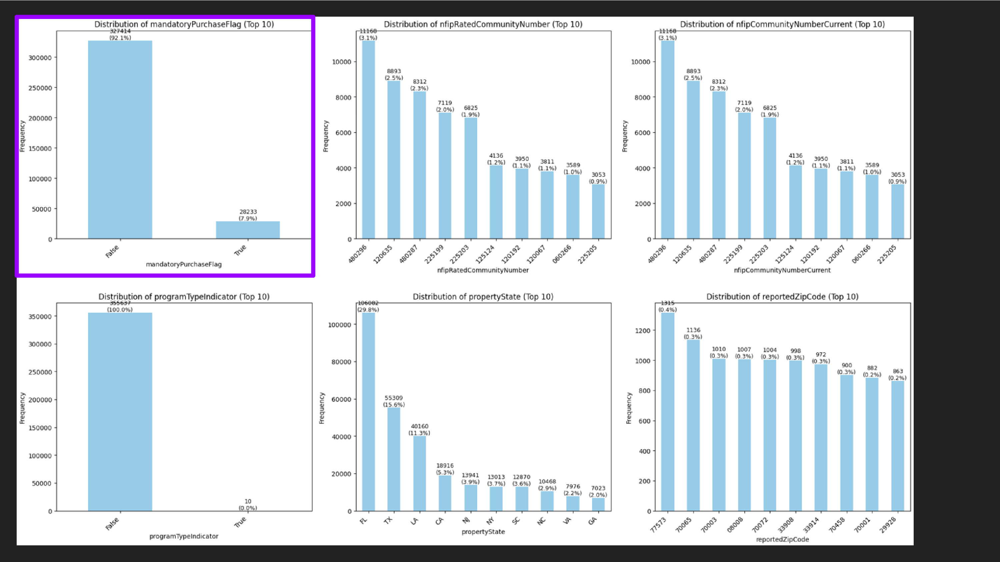
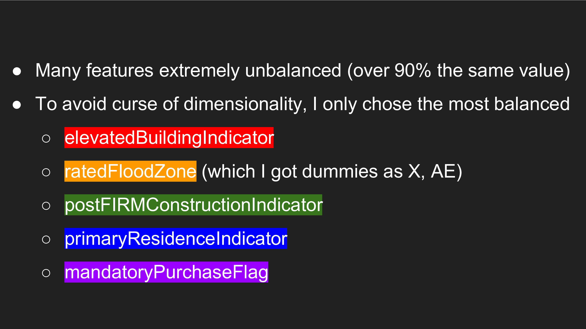
- Applied domain knowledge to select relevant features
- Dummy encoding categorical variables
- Removed highly correlated features to avoid multicollinearity
   - `policyCost` = `totalInsurancePremiumOfThePolicy` + `reserveFundAssessment` + `federalPolicyFee` + `hfiaaSurcharge`

#### 2. **Scaling & Normalization**
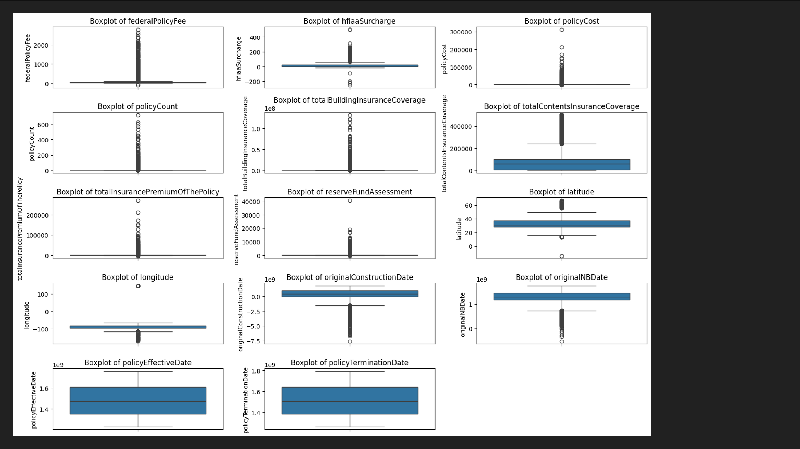
- Problem: latitude and longitude are cyclical
   - Solution: cyclical encoding by projecting latitude and longitude onto 3D Cartesian coordinates
- Problem: numerical features are skewed
   - Solution: reflecting left skewed data, then log transforming all (right) skewed data
- Problem: features have different scales
   - Solution: `StandardScaler`

### Output
- Preprocessed training features: `preprocessing_train.parquet`
- Preprocessed test features: `preprocessing_test.parquet`

---

## Modeling
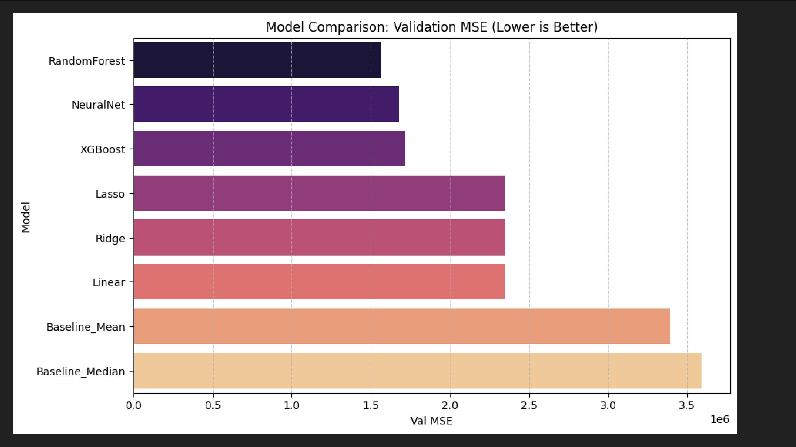
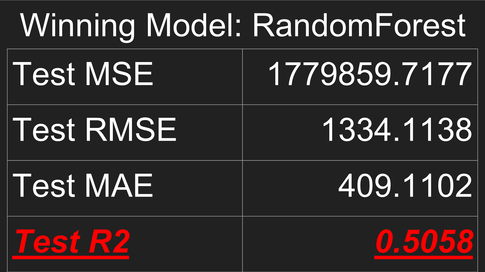
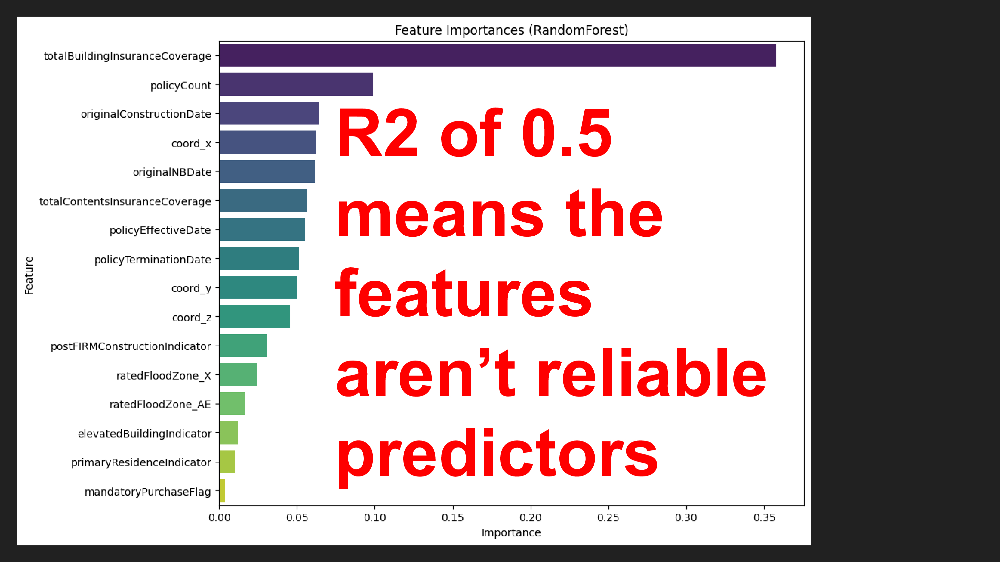

### Performance Metrics File
Detailed metrics are available in: `model_metrics.txt`

---

## Conclusion

### Summary of Findings
This project successfully analyzed a representative sample of the FEMA NFIP dataset to explore its features in relation to `policyCost` through systematic data exploration, preprocessing, and modeling.

### Key Achievements
1. **Data Processing**: Successfully sampled and cleaned representative sample of a 70+ million row dataset
2. **Analysis**: Identified features that can contribute to predicting `policyCost`
3. **Modeling**: Developed 6 models with the best MSE achieved on the Random Forests model

### Model Reliability & Considerations
- Best performing model shows $R^2=0.5058$ on test data
- Model is suitable for exploring data, but not reliable for actual predictions
- Consider developing models for other purposes (e.g. predicting `policyCost` increase with time)

---

## Possible Future Steps

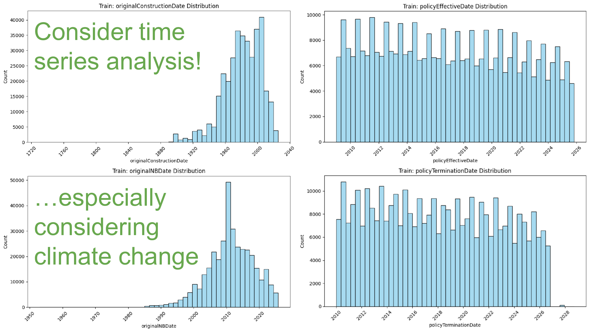
- Consider integrating other datasets (e.g. greenhouse gas pollution)

---

## Contact & Support

**Project Owner**: Robert W. Zhou  
**GitHub**: [@robertwzhou](https://github.com/robertwzhou)  
**Repository**: [Capstone2_FEMA_NFIPD](https://github.com/robertwzhou/Capstone2_FEMA_NFIPD)

### Questions or Feedback?
- Open an issue on GitHub
- Check existing documentation in this README
- Review individual notebook comments for detailed methodology

---
## Acknowledgments
- Mentor: [Ale Berbesi](https://www.linkedin.com/in/alejandra-berbesi-becerra/)
- Data source: [OpenFEMA dataset](https://www.fema.gov/openfema-data-page/fima-nfip-redacted-policies-v2) as of March 2026

---

**Last Updated**: May 19, 2026  
**Project Status**: Completed
